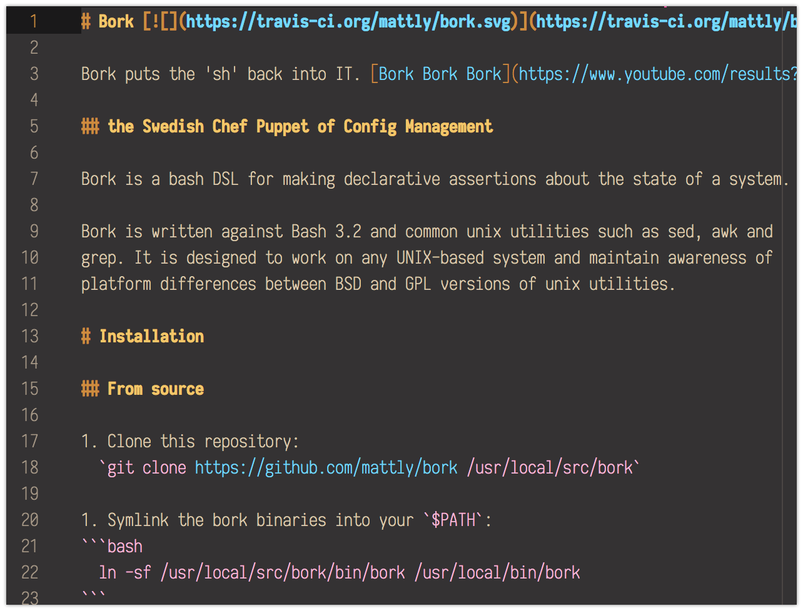
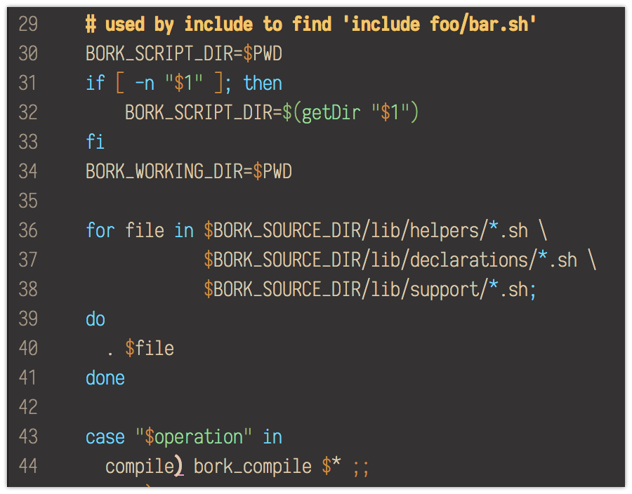

# Sector One

A dark brown syntax theme for the [Atom Editor](atom.io) heavily inspired by
the colors on its website as of April 2018, with contrast ratios from the
[zone system](https://en.wikipedia.org/wiki/Zone_System).

Comments are colored brightly under the belief they are callouts and your
attention should be drawn to them, rather than ignored.

## Screenshots
### Clojure

### ECMAscript

### HTML / Hugo

## Markdown

### Shell Scripts

